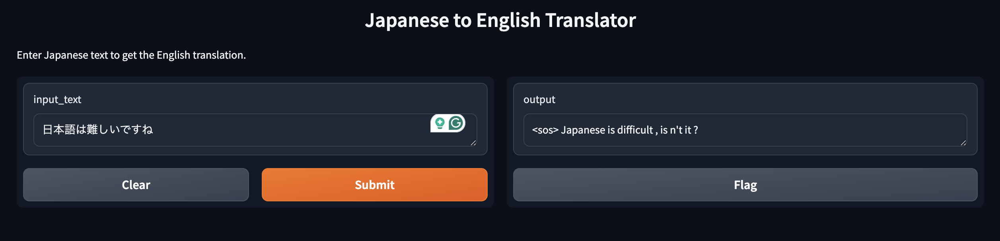

## Gradio-App for Japanese English Translation Model

This code uses a publicly available implementation of transformer architecture from scratch and uses a Japanese - English training set to create a machine translation model. 

> python transformer.py

This code trains the model for 100 epochs. Next, you can refer to the inference folder and run the

> python translate.py

This will give you the URL for the Gradio application, which looks like the above image.
